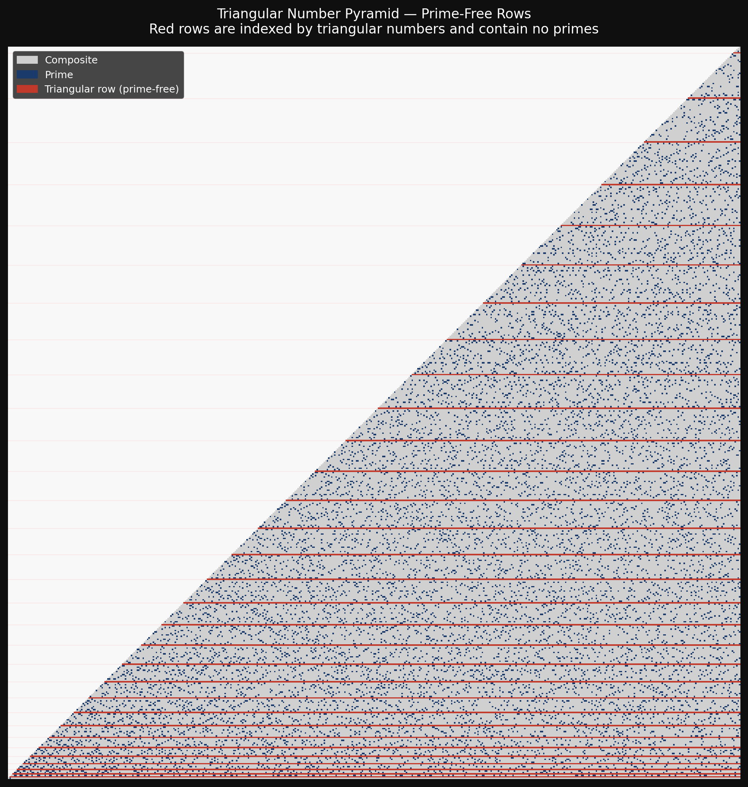
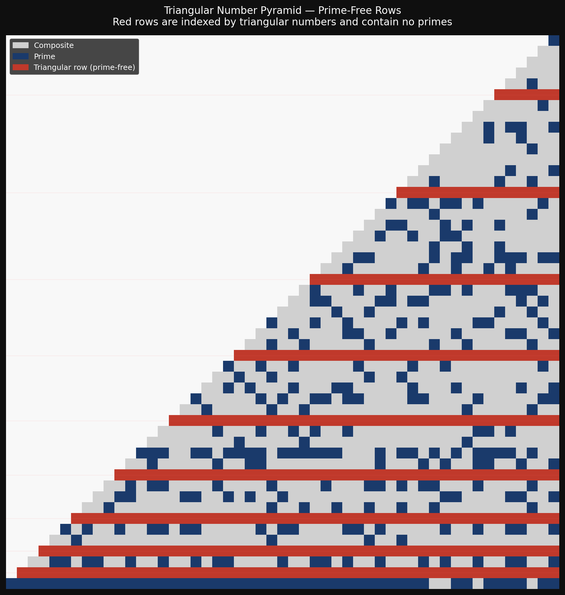

# Triangular Numbers Hide the Primes

*A small number curiosity: in a particular infinite pyramid of integers, every row indexed by a triangular number is entirely free of primes.*

---

## The Pyramid

Arrange the positive integers in a triangular grid, filling column by column. Each column `c` holds `c+1` entries, indexed by row `r` from `0` (bottom) to `c` (top):

```
13 |                                      92
12 |                                  81  93
11 |                               67 82  94
10 |                            56 68 83  95
 9 |                         46 57 69 84  96
 8 |                      37 47 58 70 85  97
 7 |                   29 38 48 59 71 86  98
 6 |                22 30 39 49 60 72 87  99
 5 |             16 23 31 40 50 61 73 86 100
 4 |          11 17 24 32 41 51 62 74 87 101
 3 |        7 12 18 25 33 42 52 63 75 88 102
 2 |     4  8 13 19 26 34 43 53 64 76 89 103
 1 |   2 5  9 14 20 27 35 44 54 65 77 90 104
 0 | 1 3 6 10 15 21 28 36 45 55 66 78 91 105
   | ---------------------------------------
   | 0 1 2  3  4  5  6  7  8  9 10 11 12  13
```

The value at column `c`, row `r` is given by the closed form:

$$f(c,\, r) = \frac{c^2 + 3c}{2} + (1 - r) \qquad 0 \le r \le c$$

The **bottom row** (`r = 0`) is:

$$f(c,\, 0) = \frac{c^2 + 3c}{2} + 1 = \frac{(c+1)(c+2)}{2} = T(c+1)$$

That is, the bottom row consists exactly of the **triangular numbers** $T(1), T(2), T(3), \ldots$

---

## The Observation

Look at row `r = 6`. Reading across:

```
22, 30, 39, 49, 60, 72, 87, 99, ...
```

Every single number is composite. No primes. The same is true for rows `r = 10`, `r = 15`, `r = 21`, `r = 28`, … — and these are precisely the **triangular numbers**.

> **Claim:** For every triangular number $T \geq 6$, row $r = T$ of the pyramid contains no prime numbers.

---

## Why It Works

Fix a triangular row $r = T$ and look at the general formula:

$$f(c,\, T) = \frac{c^2 + 3c + 2(1-T)}{2}$$

We want to factor the numerator $c^2 + 3c + 2(1-T)$ as $(c+a)(c+b)$. Matching coefficients:

$$a + b = 3, \qquad ab = 2(1 - T)$$

This is a quadratic in $a$: its discriminant is:

$$\Delta = (a-b)^2 = (a+b)^2 - 4ab = 9 - 8(1-T) = 1 + 8T$$

**Integer solutions exist if and only if $1 + 8T$ is a perfect square.** And there is a classical characterisation of triangular numbers:

> $T$ is a triangular number $\iff$ $1 + 8T$ is a perfect square.

So for triangular $T = \tfrac{m(m+1)}{2}$:

$$1 + 8T = 1 + 4m(m+1) = (2m+1)^2 \checkmark$$

giving $a = \tfrac{3-(2m+1)}{2} = 1-m$ and $b = \tfrac{3+(2m+1)}{2} = m+2$, so:

$$\boxed{f(c,\, T_m) = \frac{(c + 1 - m)(c + m + 2)}{2}}$$

For $T \geq 6$ (i.e. $m \geq 3$), and $c \geq T$ (the valid range of the pyramid), both factors exceed 1, so the product is always composite. **QED.**

### The factorings for the first few triangular rows

| Row $r$ | $m$ | Factored form | Example |
|---------|-----|---------------|---------|
| $r = 6$  | 3 | $(c-2)(c+5)/2$ | $f(6,6) = 4 \cdot 11 / 2 = 22$ |
| $r = 10$ | 4 | $(c-3)(c+6)/2$ | $f(10,10) = 7 \cdot 16 / 2 = 56$ |
| $r = 15$ | 5 | $(c-4)(c+7)/2$ | $f(15,15) = 11 \cdot 22 / 2 = 121$ |
| $r = 21$ | 6 | $(c-5)(c+8)/2$ | $f(21,21) = 16 \cdot 29 / 2 = 232$ |
| $r = 28$ | 7 | $(c-6)(c+9)/2$ | $f(28,28) = 22 \cdot 37 / 2 = 407$ |

---

## The Self-Referential Loop

The structure has a pleasing circularity:

1. The **bottom row** of the pyramid *is* the sequence of triangular numbers.
2. Each triangular number $T$ in the bottom row **labels a prime-free row** higher up.
3. This works because triangular numbers are *exactly* the values for which $1 + 8T$ is a perfect square — the condition needed for the row to factor over the integers.

The pyramid encodes the triangular-number characterisation in its own geometry.

---

## Bonus: Euler's Prime-Generating Formula

The same pyramid, run with `offset=43, increment=2`, produces a different arrangement where every second integer is placed:

```
 5 |                73
 4 |             63 75
 3 |          55 65 77
 2 |       49 57 67 79
 1 |    45 51 59 69 81
 0 | 43 47 53 61 71 83
   | ----------------------
   |  0  1  2  3  4  5
```

With coordinates `(x, y)` — `x` along the bottom, `y` upward — the general formula becomes:

$$f(x,\, y) = (x+y)^2 + 3(x+y) + 43 - 2y = x^2 + 2xy + y^2 + 3x + y + 43$$

Now set `x = 0` (the **left edge**):

$$f(0,\, y) = y^2 + y + 43$$

Which is exactly **Euler's prime-generating formula** $n^2 + n + 41$, shifted by two — starting at $n=1$ rather than $n=0$, since the sequence opens at 43.

Euler's formula is famous for producing primes for $n = 0, 1, \ldots, 39$ — a run of 40 consecutive primes. It emerges here not by magic but as a direct consequence of the quadratic structure of the pyramid: spacing by 2 makes the diagonal index $d = x+y$ appear squared in the formula, and the left edge $x=0$ isolates the pure $y^2 + y$ term. Add the offset 41 and Euler's sequence is inevitable.

In other words: **Euler's formula is just what the left edge of this pyramid looks like when you count by twos starting from 43.**

---

## Related Work: Klauber's Triangular Prime Arrangement

This pyramid sits in a broader tradition of arranging integers in triangular grids to reveal prime structure.

In 1932, Laurence Monroe Klauber — an American herpetologist and foremost authority on rattlesnakes — presented a paper to the Mathematical Association of America on a triangular, non-spiral matrix demonstrating geometric regularity in the distribution of primes. His triangle places row $n$ containing the numbers $(n-1)^2 + 1$ through $n^2$. As in the later Ulam spiral, quadratic polynomials generate numbers that lie in straight lines; vertical lines correspond to numbers of the form $k^2 - k + M$.

The key geometric difference: the lines of primes in the Klauber triangle meet at 60° angles, while in Ulam's square spiral (1963) they meet at 90° angles. Both arrangements make Euler's prime-generating polynomial $n^2 + n + 41$ visually prominent — in the Klauber triangle, the Euler primes appear as clear vertical streaks.

Klauber's construction differs from the pyramid here in one important way: his rows grow as perfect-square bands $(1, 3, 5, 7, \ldots)$, whereas this pyramid fills column-by-column with rows of triangular-number width. This is what makes the prime-free row property algebraically accessible — the column formula $f(c, r) = (c^2 + 3c)/2 + (1-r)$ factors cleanly over integer rows exactly when $1 + 8r$ is a perfect square, i.e. when $r$ is triangular. Klauber's row structure doesn't have this property.

Klauber's work predated Ulam by over thirty years but went largely unnoticed until Martin Gardner mentioned it in his 1964 *Scientific American* column on the Ulam spiral.

---

## Visualisation





*Dark blue = prime. Grey = composite. Red rows = triangular-indexed (prime-free). White = outside the pyramid.*

---

## Running the Code

```bash
pip install matplotlib numpy
python triangular_primes.py
```

This will:
1. Print a verification report confirming all triangular rows (up to column 50) are prime-free.
2. Confirm non-triangular rows contain primes.
3. Save `pyramid.png` and `euler_pyramid.png`.

### Example output

```
═══════════════════════════════════════════════════════════════════
TRIANGULAR PRIME-FREE ROWS — VERIFICATION REPORT
═══════════════════════════════════════════════════════════════════

Pyramid formula: f(c, r) = (c² + 3c)/2 + (1 - r)
Checking columns up to c = 50

TRIANGULAR ROWS (expected: prime-free)
  r =   6  →  f(c,6)  = (c-2)(c+5)/2      ✓ PRIME-FREE
  r =  10  →  f(c,10) = (c-3)(c+6)/2      ✓ PRIME-FREE
  r =  15  →  f(c,15) = (c-4)(c+7)/2      ✓ PRIME-FREE
  r =  21  →  f(c,21) = (c-5)(c+8)/2      ✓ PRIME-FREE
  ...
  All triangular rows prime-free (r ≥ 6): YES ✓
```

---

## A Note on Scope

This is a curiosity, not a deep theorem. The factoring argument is elementary, and the connection to the triangular-number characterisation ($n$ is triangular $\iff 1+8n$ is a perfect square) is classical. What makes it pleasant is how the pyramid arranges itself so that its own bottom row encodes exactly which of its higher rows will be prime-free.

---

## License

MIT — do whatever you like with it.

---

*This README was written by [Claude](https://claude.ai) (Anthropic).*
